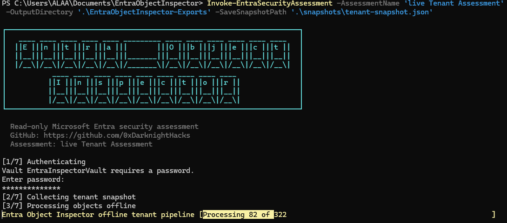
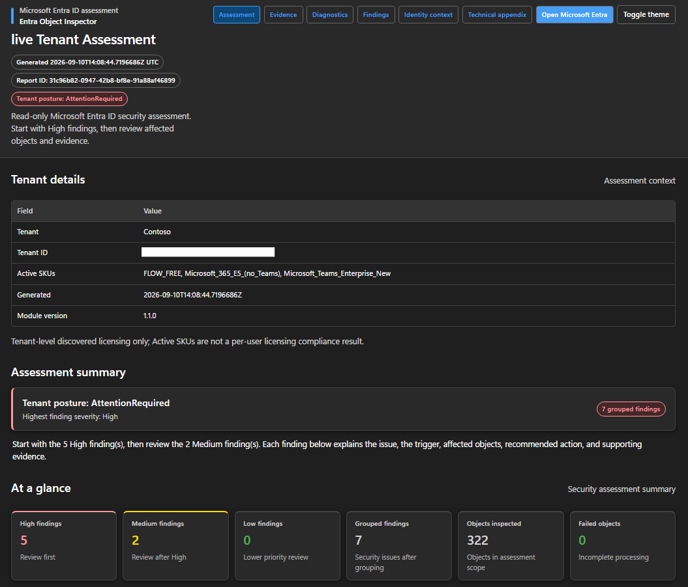
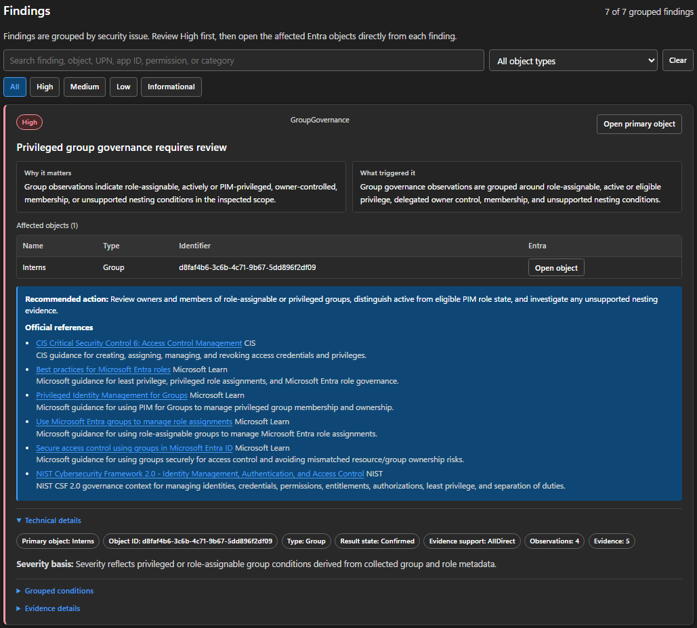
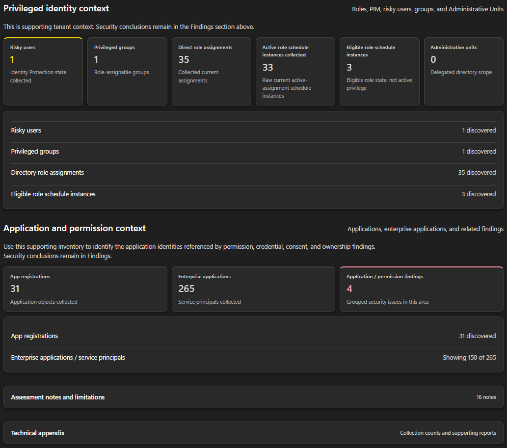
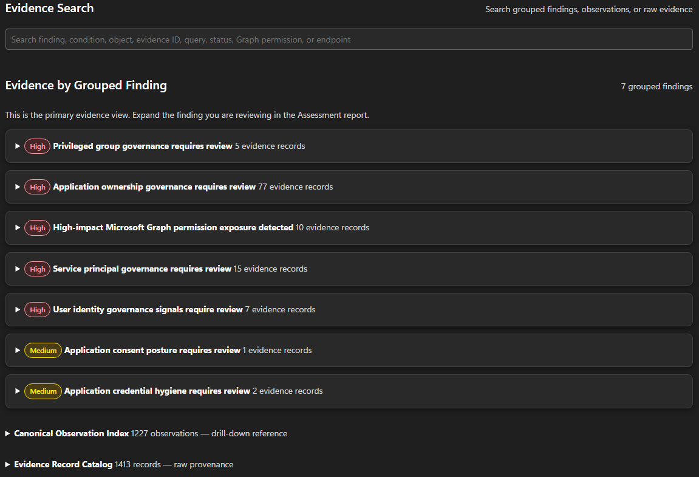
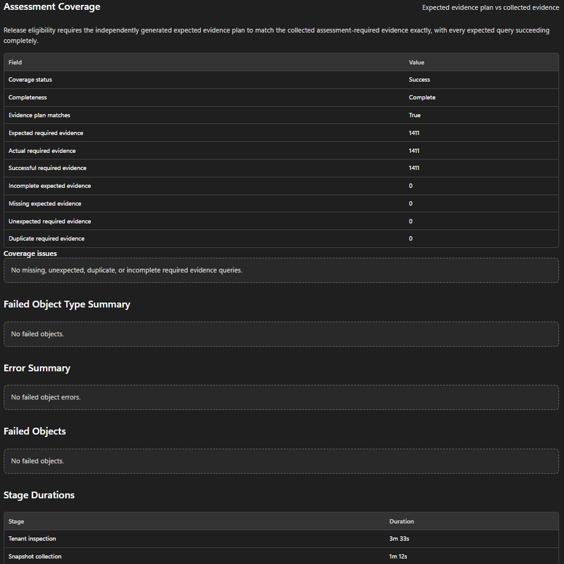

<div align="center">

# Entra Object Inspector

**Read-only security assessment for Microsoft Entra ID**

[](#)
[](#requirements)
[](#validation)
[](LICENSE)

Entra Object Inspector collects tenant data through Microsoft Graph, builds a deterministic snapshot, correlates identities and relationships, and produces evidence-backed findings and self-contained HTML reports.

[Quick start](#quick-start) · [What it covers](#what-it-covers) · [Requirements](#requirements) · [Permissions](#permissions) · [Docs](#usage) · [Security model](#security-model)

</div>

---

## Table of contents

- [What it covers](#what-it-covers)
- [Screenshots](#screenshots)
- [Requirements](#requirements)
- [Permissions](#permissions)
- [Quick start](#quick-start)
  - [1. Install](#1-install)
  - [2. Configure authentication](#2-configure-authentication)
  - [3. Run an assessment](#3-run-an-assessment)
- [Usage](#usage)
  - [Live tenant assessment](#live-tenant-assessment)
  - [Live assessment with a saved snapshot](#live-assessment-with-a-saved-snapshot)
  - [Offline assessment from a snapshot](#offline-assessment-from-a-snapshot)
  - [Compare two snapshots](#compare-two-snapshots)
  - [Target specific objects](#target-specific-objects)
- [Output](#output)
- [Security model](#security-model)
- [Validation](#validation)
- [Repository structure](#repository-structure)
- [Contributing & security reporting](#contributing--security-reporting)
- [License](#license)

---

## What it covers

| Area | Details |
|---|---|
| Identities | Users and groups |
| Applications | App registrations and service principals |
| Relationships | Ownership, membership, permissions, and app-role assignments |
| Privilege | Directory roles, role-assignable groups, active & eligible PIM schedule instances |
| Scope | Administrative Unit boundaries |
| Risk correlation | Risky-user privilege correlation, cross-object security observations |
| Portability | Offline snapshots, snapshot comparison / drift assessment |
| Targeting | Targeted assessments, rule packs, accepted-condition baselines |
| Reporting | JSON, CSV, Markdown, diagnostics, evidence, and HTML reports |

> Entra Object Inspector is a read-only **assessment and investigation** tool. It does not remediate tenant configuration or calculate numerical risk scores.

## Screenshots

<details>
<summary><b>CLI assessment invoke</b></summary>


</details>

<details>
<summary><b>Main HTML report overview</b></summary>


</details>

<details>
<summary><b>Finding evidence drill-down</b></summary>


</details>

<details>
<summary><b>Privileged identity overview</b></summary>


</details>

<details>
<summary><b>Evidence report overview</b></summary>


</details>

<details>
<summary><b>Diagnostics report overview</b></summary>


</details>

## Requirements

- PowerShell 7.6 LTS or later
- A Microsoft Entra application registration
- App-only Microsoft Graph authentication using a client secret

**Release-validated module dependencies**

| Dependency | Version |
|---|---:|
| `Microsoft.Graph.Authentication` | 2.39.0 |
| `Microsoft.PowerShell.SecretManagement` | 1.1.2 |
| `Microsoft.PowerShell.SecretStore` | 1.0.6 |

## Permissions

Use the **least-privilege permission set appropriate to the assessment you intend to run** — not every permission below is needed for every assessment.

| Scope | Permission |
|---|---|
| Applications | `Application.Read.All` |
| Users | `User.Read.All` |
| Groups | `GroupMember.Read.All` |
| Directory objects | `Directory.Read.All` |
| PIM | PIM schedule read permissions |
| Administrative Units | `AdministrativeUnit.Read.All` |
| Risky users | `IdentityRiskyUser.Read.All` |
| Hidden membership *(if in scope)* | `Member.Read.Hidden` |

## Quick start

### 1. Install

```powershell
git clone https://github.com/0xDarknightHacks/EntraObjectInspector.git
cd .\EntraObjectInspector

Install-Module Microsoft.Graph.Authentication -RequiredVersion 2.39.0 -Scope CurrentUser
Install-Module Microsoft.PowerShell.SecretManagement -RequiredVersion 1.1.2 -Scope CurrentUser
Install-Module Microsoft.PowerShell.SecretStore -RequiredVersion 1.0.6 -Scope CurrentUser

Import-Module .\EntraObjectInspector.psd1 -Force
```

Validate the local environment:

```powershell
.\Scripts\Test-EntraObjectInspectorRequirements.ps1
```

### 2. Configure authentication

Create the local configuration file:

```powershell
New-Item -ItemType Directory -Path "$HOME\.entra-object-inspector" -Force

@{
    TenantId = "<tenant-id>"
    ClientId = "<application-client-id>"
} | ConvertTo-Json | Set-Content "$HOME\.entra-object-inspector\config.json"
```

Store the client secret with PowerShell SecretManagement:

```powershell
Register-SecretVault `
    -Name EntraInspectorVault `
    -ModuleName Microsoft.PowerShell.SecretStore

Set-Secret `
    -Name InspectorGraphClientSecret `
    -Vault EntraInspectorVault `
    -Secret "<client-secret>"
```

> ⚠️ **Never commit** tenant identifiers, secrets, snapshots, reports, diagnostics, or exported assessment data.

### 3. Run an assessment

```powershell
Invoke-EntraSecurityAssessment `
    -AssessmentName "Tenant Assessment" `
    -OutputDirectory ".\EntraObjectInspector-Exports"
```

See [Usage](#usage) below for snapshots, offline mode, drift comparison, and targeted assessments.

## Usage

### Live tenant assessment

```powershell
Invoke-EntraSecurityAssessment `
    -AssessmentName "Tenant Assessment" `
    -OutputDirectory ".\EntraObjectInspector-Exports"
```

### Live assessment with a saved snapshot

```powershell
Invoke-EntraSecurityAssessment `
    -AssessmentName "Tenant Assessment" `
    -SaveSnapshotPath ".\snapshots\tenant.json"
```

### Offline assessment from a snapshot

```powershell
Invoke-EntraSecurityAssessment `
    -AssessmentName "Offline Assessment" `
    -SnapshotPath ".\snapshots\tenant.json"
```

Portable offline mode performs **zero Microsoft Graph requests**.

### Compare two snapshots

```powershell
Invoke-EntraSecurityAssessment `
    -AssessmentName "Drift Review" `
    -SnapshotPath ".\snapshots\current.json" `
    -CompareToSnapshotPath ".\snapshots\previous.json"
```

### Target specific objects

```powershell
Invoke-EntraSecurityAssessment `
    -AssessmentName "Targeted Review" `
    -Target "Application|<object-id>","ServicePrincipal|<object-id>"
```

For rule packs, baselines, advanced options, and manual pipeline commands:

```powershell
Get-Help Invoke-EntraSecurityAssessment -Examples
Get-Help Invoke-EntraSecurityAssessment -Full
```

## Output

Each assessment produces a timestamped package containing:

- **Three self-contained HTML reports** — main assessment, evidence, and diagnostics
- Manifest, observations, grouped findings, object/evidence indexes, correlations, limitations, recommendations, and execution metadata
- Assessment intelligence summary

> Generated output may contain sensitive tenant information — store and share it accordingly.

## Security model

- Entra Object Inspector is **read-only end to end**. Tenant operations use Microsoft Graph `GET` requests.
- High-volume collection may use Graph JSON batching (`$batch`), where the outer request is `POST` but every contained operation remains a read-only `GET`.
- After snapshot collection, all assessment intelligence, correlation, export, and report generation run **offline** — no further Graph calls. `GraphCallsAfterSnapshot` is used as a release boundary check.

## Validation

The v1.0.3 release was validated with:

- ✅ 349/349 Pester tests passing
- ✅ Successful tenant-wide live assessment
- ✅ Successful portable offline assessment
- ✅ Zero failed objects in validated live and offline runs
- ✅ `PackageValidationStatus = Success`, `ReleaseEligible = True`
- ✅ `GraphCallsAfterSnapshot = 0`, zero Graph requests during offline analysis

Run the test suite yourself:

```powershell
Invoke-Pester -Path .\Tests -Output Detailed
```

## Repository structure

```text
Public/      Exported PowerShell commands
Private/     Internal assessment implementation
Scripts/     Validation and operator helpers
Schemas/     Rule-pack, baseline, and artifact schemas
Tests/       Pester test suite
```

## Contributing & security reporting

- Development guidance: [CONTRIBUTING.md](CONTRIBUTING.md)
- Security reporting: [SECURITY.md](SECURITY.md)

Contributions should preserve the read-only Microsoft Graph boundary, deterministic snapshot behavior, evidence provenance, and fail-closed coverage semantics.

## License

Licensed under the [MIT License](LICENSE).
