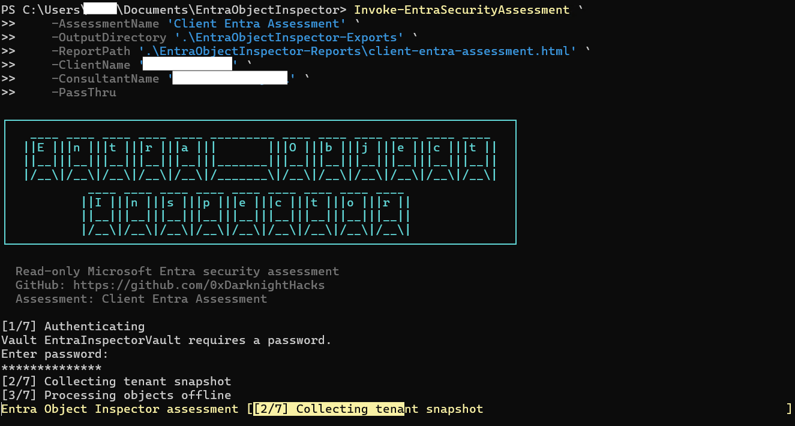
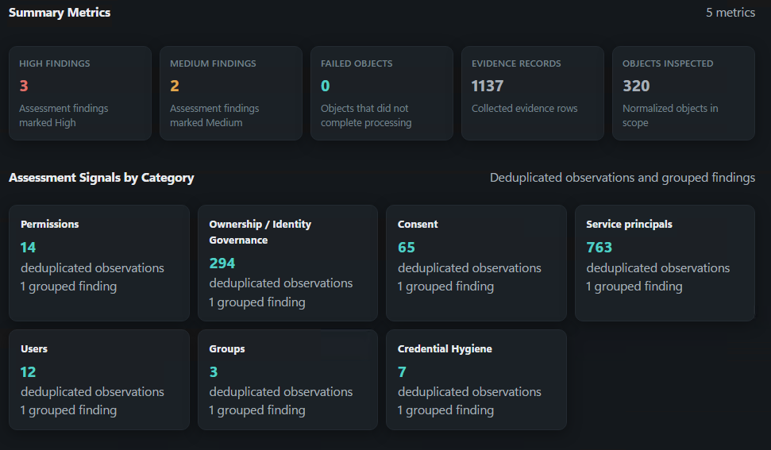
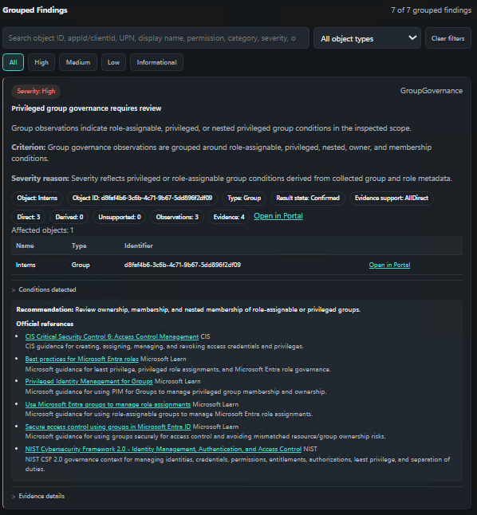

# Entra Object Inspector

Entra Object Inspector is a read-only PowerShell tool for assessing Microsoft Entra ID objects and relationships through Microsoft Graph. It inspects users, groups, applications, and service principals, preserves supporting evidence, generates assessment findings, and exports structured artifacts and self-contained HTML reports.

## Scope

The tool supports:

- Users
- Groups
- Application registrations
- Service principals / enterprise applications
- Correlated application identities
- Ownership, membership, permission, and app-role relationship evidence
- Privileged identity context for directory role assignments, current PIM role state, Administrative Unit scope, and risky-user state
- Tenant-wide assessment
- JSON, CSV, Markdown, and static HTML reporting

Entra Object Inspector is assessment-only. It does **not** remediate, modify tenant configuration, perform risk/exposure scoring, or execute attack/privilege-path analysis.

Tenant-wide assessments use a snapshot-first model. Microsoft Graph is used to collect the required tenant data; subsequent resolution, relationship processing, observations, assessment intelligence, exports, and reports operate offline against the collected data.

## Requirements

- PowerShell 7.6 LTS or later
- Microsoft Entra application registration
- App-only Microsoft Graph authentication using a client secret
- Required Microsoft Graph application permissions with admin consent

Release-validated dependencies:

| Dependency | Version |
| --- | ---: |
| `Microsoft.Graph.Authentication` | 2.39.0 |
| `Microsoft.PowerShell.SecretManagement` | 1.1.2 |
| `Microsoft.PowerShell.SecretStore` | 1.0.6 |
| `Pester` (development only) | 6.1.0 |

### Microsoft Graph permissions

Permissions depend on the objects and relationships being assessed. The collection logic uses:

- `Application.Read.All`
- `User.Read.All`
- `GroupMember.Read.All`
- `Member.Read.Hidden` when hidden group membership is in scope
- `Directory.Read.All`
- `RoleManagement.Read.Directory`
- `RoleAssignmentSchedule.Read.Directory` for current active PIM directory-role schedule instances
- `RoleEligibilitySchedule.Read.Directory` for current eligible PIM directory-role schedule instances
- `AdministrativeUnit.Read.All` for Administrative Unit scope and membership context
- `IdentityRiskyUser.Read.All` for Microsoft Entra ID Protection risky-user context

`Organization.Read.All` is optional. It is used for organization metadata and, when granted, also authorizes the optional `/subscribedSkus` tenant-license capability inventory. The project's existing `Directory.Read.All` permission also authorizes `/subscribedSkus`; therefore a normal full assessment does not need an additional license-inventory permission. For a reduced permission set that has neither `Directory.Read.All` nor `Organization.Read.All`, `LicenseAssignment.Read.All` is the least-privileged standalone permission for `/subscribedSkus`. License inventory evidence is advisory and is not itself required for assessment coverage.

`Member.Read.Hidden` remains optional. Without it, hidden group or HiddenMembership Administrative Unit membership is marked partial and the assessment fails closed for membership completeness rather than treating inaccessible membership as empty.

### Tenant license capability validation

Tenant-wide assessments optionally read Microsoft Graph `/subscribedSkus` before collecting licensed privileged-identity domains. The check is capability-aware rather than a blanket "P2 tenant" requirement:

- PIM current active/eligible schedule-instance collection requires a valid Microsoft Entra ID P2 entitlement **or** Microsoft Entra ID Governance. Microsoft Entra Suite includes ID Governance.
- Full Microsoft Entra ID Protection risky-user Graph access requires Microsoft Entra ID P2 **or** Microsoft Entra Suite.
- Microsoft 365 Business Premium includes Microsoft Entra ID P1; Business Premium alone therefore does not satisfy either capability. Add-on products can change that result, so the collector evaluates provisioned service-plan identifiers rather than product display names.
- Directory role definitions/assignments and Administrative Unit collection are not blanket-gated by this PIM/Identity Protection license check.

When license inventory conclusively shows that a required capability is unavailable, the corresponding PIM or risky-user request is not sent. Its evidence is recorded as `LicenseUnavailable / Partial`, the limitation is explicit, and release eligibility remains false rather than treating the inaccessible domain as a successful empty collection. If `/subscribedSkus` cannot be read, license prevalidation remains `Unknown`; the feature endpoints are still attempted and their evidence remains authoritative.

This is a **tenant capability** check only. It does not validate per-user seat assignment, license quantity, or Microsoft licensing compliance.

Use the least-privilege permission set appropriate for the intended assessment scope.

## Installation

```powershell
git clone https://github.com/0xDarknightHacks/EntraObjectInspector.git
cd .\EntraObjectInspector

Install-Module Microsoft.Graph.Authentication -RequiredVersion 2.39.0 -Scope CurrentUser
Install-Module Microsoft.PowerShell.SecretManagement -RequiredVersion 1.1.2 -Scope CurrentUser
Install-Module Microsoft.PowerShell.SecretStore -RequiredVersion 1.0.6 -Scope CurrentUser

Import-Module .\EntraObjectInspector.psd1 -Force
```

Validate the local runtime and module requirements:

```powershell
.\Scripts\Test-EntraObjectInspectorRequirements.ps1
```

## Configuration

Create the local configuration file:

```powershell
New-Item -ItemType Directory -Path "$HOME\.entra-object-inspector" -Force

@{
    TenantId = "<tenant-id>"
    ClientId = "<application-client-id>"
} | ConvertTo-Json | Set-Content "$HOME\.entra-object-inspector\config.json"
```

Store the application client secret with PowerShell SecretManagement:

```powershell
Register-SecretVault `
    -Name EntraInspectorVault `
    -ModuleName Microsoft.PowerShell.SecretStore

Set-Secret `
    -Name InspectorGraphClientSecret `
    -Vault EntraInspectorVault `
    -Secret "<client-secret>"
```

Do not commit tenant identifiers, credentials, local configuration, assessment exports, reports, or diagnostics.

## Run an Assessment

For a complete tenant assessment:

```powershell
Invoke-EntraSecurityAssessment `
    -AssessmentName "Contoso Entra Assessment" `
    -OutputDirectory ".\EntraObjectInspector-Exports"
```

To specify the report path and open it after generation:

```powershell
Invoke-EntraSecurityAssessment `
    -AssessmentName "Contoso Entra Assessment" `
    -OutputDirectory ".\EntraObjectInspector-Exports" `
    -ReportPath ".\EntraObjectInspector-Reports\contoso-assessment.html" `
    -OpenReport
```

The command performs authentication, snapshot collection, tenant inspection, assessment intelligence, structured export, and HTML report generation.

### Focused workflows

Use the workflow in this order when you need repeatable evidence: connect, collect
or save a snapshot, inspect offline, compare snapshots, apply baselines or rule
packs, then export and report.

Save a portable snapshot during a live assessment, then re-analyze it later without Graph collection:

```powershell
Invoke-EntraSecurityAssessment `
    -AssessmentName "Current" `
    -SaveSnapshotPath ".\snapshots\current.json"

Invoke-EntraSecurityAssessment `
    -AssessmentName "Offline reanalysis" `
    -SnapshotPath ".\snapshots\current.json"
```

Limit live collection to explicit targets (CSV/TXT is also supported through `-TargetFile`):

```powershell
Invoke-EntraSecurityAssessment `
    -AssessmentName "Targeted application review" `
    -ObjectType Application,ServicePrincipal `
    -Target "Application|<object-id>","ServicePrincipal|<object-id>"
```

Compare deterministic snapshots, or apply a declarative rule pack and accepted-condition baseline offline:

```powershell
Invoke-EntraSecurityAssessment `
    -AssessmentName "Drift review" `
    -SnapshotPath ".\snapshots\current.json" `
    -CompareToSnapshotPath ".\snapshots\previous.json"

Invoke-EntraSecurityAssessment `
    -AssessmentName "Policy review" `
    -SnapshotPath ".\snapshots\current.json" `
    -RulePackPath ".\policy\rules.json" `
    -BaselinePath ".\policy\baseline.json"
```

Interactive completion output and report telemetry distinguish tenant-wide, targeted, and portable-offline execution. Runtime telemetry includes stage timings, offline objects/second, logical versus physical Graph requests, batching efficiency, the OS process high-water mark, a run-observed sampled working-set peak, and an exact run peak when the process high-water mark advances during that assessment. `GraphCallsAfterSnapshot` remains the post-snapshot boundary check.

`Complete` evidence means the required collector succeeded for the stated scope.
`Partial` or failed evidence is retained in exports and reports and should be
treated as a boundary on what the assessment can safely infer. Ownerless,
missing-counterpart, and similar negative observations are emitted only when
the relevant collection completed successfully.

Privileged identity context is collected during snapshot creation and processed
offline. It uses Microsoft Graph v1.0 role definitions, unified role assignments,
active and eligible PIM schedule instances, Administrative Units, AU membership,
and risky users. Unified role assignments remain the canonical source for
AU-scoped role assignments through `directoryScopeId =
/administrativeUnits/{id}`; `scopedRoleMembers` is not requested for new
snapshots.

Active PIM schedule instances are reconciled with unified role assignments so
the same effective privilege is not counted twice. `Assigned` means active
assigned privilege; `Activated` means an eligible assignment is currently active.
Privileged risky-user findings require active privileged context plus
`riskState` of `atRisk` or `confirmedCompromised`. Resolved, safe, none, and
unknown future states remain contextual. Risk detections are intentionally not
collected in this release pass because risky-user state is sufficient for the
current privilege/risk correlation and detection records are retention-bound and
more volatile.

### Deferred object-depth candidates

Identity Protection risk detections are a plausible future evidence enrichment
candidate when operators need event-level explainability for risky-user state.
They are deferred here to avoid noisy drift and additional permission scope
until the event-level data is required by a specific observation.

## Preview

### CLI assessment



### Assessment summary



### Evidence-backed finding



## Public Commands

The module exposes seven public commands:

```text
Connect-InspectorGraph
Get-EntraObjectInsight
Invoke-EntraTenantInspection
Export-EntraTenantInspection
Invoke-EntraAssessmentIntelligence
Export-EntraAssessmentReport
Invoke-EntraSecurityAssessment
```

For object-specific inspection:

```powershell
Connect-InspectorGraph
Get-EntraObjectInsight -Identity "<object-id-or-upn-or-app-id>"
```

For manual pipeline execution:

```powershell
$tenantResult = Invoke-EntraTenantInspection `
    -ObjectType Application, ServicePrincipal, User, Group `
    -MaxObjectsPerType 0 `
    -BatchSize 25

$intelligence = Invoke-EntraAssessmentIntelligence `
    -InputObject $tenantResult `
    -AssessmentName "Example Assessment"

$export = Export-EntraTenantInspection `
    -InputObject $tenantResult `
    -AssessmentIntelligence $intelligence `
    -OutputDirectory ".\EntraObjectInspector-Exports" `
    -AssessmentName "Example Assessment"

Export-EntraAssessmentReport `
    -InputObject $tenantResult `
    -AssessmentIntelligence $intelligence `
    -AssessmentName "Example Assessment" `
    -OutputPath ".\EntraObjectInspector-Reports\example-assessment.html" `
    -Force
```

## Output

A tenant assessment produces structured JSON/CSV artifacts, a Markdown summary, diagnostics, and three self-contained HTML reports:

- main assessment report
- evidence report
- diagnostics report

The export package includes the assessment manifest, summary, observations, object/evidence indexes, findings, recommendations, correlations, limitations, failed-object records, execution data, and assessment intelligence.

Generated outputs may contain sensitive tenant metadata. Store and share them accordingly.

### Report search via URL parameters

The main assessment report supports prefilling the finding search box through URL query parameters. `q` provides a free-text search query and `object` provides an object-oriented prefill; when both are present, `q` takes precedence. Search values are applied inline when the report loads and are never persisted — no local or session storage is used, so reloading the report without the parameters restores the unfiltered view.

Examples (URL-encode special characters such as spaces and `@`):

```text
report.html?q=Directory.ReadWrite.All
report.html?q=Policy.ReadWrite.ConditionalAccess
report.html?q=Finance%20Automation%20App
report.html?object=00000000-0000-0000-0000-000000000000
report.html?object=user%40contoso.com
```

Missing, empty, or unsupported parameters are ignored, so the reports degrade gracefully to the default unfiltered view in any host that does not supply them.

## Security Model

Entra Object Inspector is designed to remain read-only. Logical tenant operations use Microsoft Graph `GET` requests. Selected high-volume independent reads may use Microsoft Graph JSON batching; the outer `$batch` request uses `POST`, while its individual subrequests remain read-only `GET` operations.

Post-snapshot assessment intelligence, exports, and report generation do not require Microsoft Graph calls.

## Testing

Run the full Pester suite:

```powershell
Invoke-Pester -Path .\Tests -Output Detailed
```

The current release baseline contains **332 tests** and requires **332 passed / 0 failed / 0 skipped**.

For a broader local validation:

```powershell
.\Scripts\Test-EntraObjectInspectorRequirements.ps1 -RunTests
```

## Repository Structure

```text
Public/      Exported PowerShell commands
Private/     Internal assessment implementation
Scripts/     Local validation/operator helpers
Tests/       Pester test suite
```

## Contributing

See [CONTRIBUTING.md](CONTRIBUTING.md) for development, testing, and release guidance.

Contributions should preserve the read-only Microsoft Graph boundary and evidence/provenance behavior.

## License

Licensed under the [MIT License](LICENSE).
